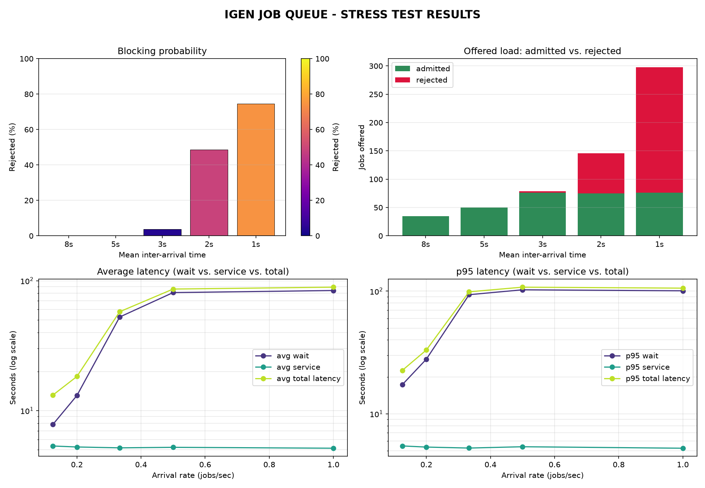

# IGen – Full Stack Generative AI System

This monorepo contains the complete IGen system: a modern frontend, robust backend, and a custom Stable Diffusion inference engine, all orchestrated for scalable, cloud-native deployment.

---

## 🗺️ Architecture Overview

```
[Frontend (React+Vite)] ⇄ [Backend (Django+Postgres, job queue)] ⇄ [Stable Diffusion Inference (Flask, RunPod GPU Pod)]
```

- **Frontend**: React SPA (Vite), deployed on Vercel
- **Backend**: Django app (`igen`), deployed on Render, backed by Postgres. Requests are enqueued as DB-backed jobs and dispatched asynchronously — the frontend submits and polls by job id rather than holding a request open
- **Inference**: Custom Stable Diffusion server (Flask), deployed on a RunPod GPU pod, called over direct TCP (not RunPod's HTTP proxy, which has too short a timeout for real generation calls)

---

## 📦 Monorepo Structure

```
IGen/
├── frontend/         # React + Vite UI (Vercel)
├── backend/          # Django API, job queue & dispatcher (Render)
├── StableDiffusion/  # Custom SD inference server (RunPod)
├── scripts/
│   └── stress_test/  # Load-testing tool + results for the job queue
└── README.md         # (this file)
```

---

## 🚀 Deployment Overview

| Component        | Stack              | Deployment   |
| ---------------- | ------------------ | ------------ |
| Frontend         | React, Vite        | Vercel       |
| Backend          | Django, Gunicorn   | Render       |
| Inference Engine | Flask, PyTorch, SD | RunPod (GPU) |

- **Persistent Volumes**: RunPod pod mounts `/runpod-volume/weights` and `/runpod-volume/outputs` for model and output persistence.
- **API Flow**: Frontend submits → Backend enqueues a `Job` row and returns immediately → a background dispatcher thread claims and sends it to the Pod → Frontend polls for the result.
- **Queue protection**: a bounded queue depth (`MAX_QUEUE_DEPTH`) rejects new requests once too many are already pending/in-flight, instead of letting the backlog and wait time grow without limit. See [Stress Test Results](#-stress-test-results) below for measured behavior under load.
- **Job outcomes** are tracked as distinct, queryable states — `COMPLETED`, `FAILED` (genuine error), `TIMEOUT` (Pod didn't respond in time), `REJECTED` (queue was full) — each with real dispatch/completion timestamps, exposed via metrics endpoints.

---

## Application Frontend UI Image


---

## 🔗 Component Summaries

### Frontend ([details](./frontend/README.md))

- React + Vite SPA with two flows: text-to-image **Generate**, and mask-guided **Inpaint**
- Inpaint supports a continuous (non-binary) mask for a "noise-extent" brush, plus a client-side cover-scale + single-axis crop step so arbitrary-aspect uploads are windowed onto the model's fixed 512×512 input without squishing — the edited window is composited back into the full-resolution original afterward
- Submits jobs and polls status by id (session-scoped, so multiple tabs never cross-wire which job they're tracking)
- Gated behind a passkey (`AccessKey`) before use
- Deployed on Vercel

### Backend ([details](./backend/README.md))

- Django app with custom `igen` module: job queue (Postgres-backed `Job` model), background dispatcher thread, metrics endpoints
- Scoped, revocable `AccessKey` auth (`app` / `metrics` scopes), per-key cooldown, per-IP rate limiting on the key-verification endpoint
- Bounded queue depth, distinct FAILED/TIMEOUT/REJECTED job outcomes, 3-day image-retention purge (Postgres free tier)
- Production HTTPS/cookie hardening (SSL redirect, secure cookies, HSTS)
- Deployed on Render with Gunicorn

### Stable Diffusion Inference ([details](./StableDiffusion/README.md))

- Custom, from-scratch pipeline: CLIP text encoder, VAE Encoder/Decoder, UNet (cross-attention), and a custom DDPM sampler — not a wrapper around an existing diffusion library
- Supports text-to-image and mask-guided inpainting with configurable steps, seed, denoising strength, and guidance scale
- Loads weights from HuggingFace ([model](https://huggingface.co/stable-diffusion-v1-5/tree/main), [tokenizer](https://huggingface.co/stable-diffusion-v1-5/tree/main/tokenizer))
- Flask API exposes `/inference`, bearer-token gated
- Deployed on a RunPod GPU pod with persistent storage, called directly over TCP

---

## 🧠 Tech Stack

- **Frontend**: React, Vite, JavaScript/JSX, Vercel
- **Backend**: Django, Postgres, Gunicorn, Python, Render
- **Inference**: Flask, PyTorch, custom SD pipeline, RunPod
- **ML Models**: CLIP, VAE, UNet (from Umar Jamil’s implementation)
- **Tokenizer/Weights**: HuggingFace
- **Load testing**: Python (`scripts/stress_test/`), matplotlib

---

## 🛠️ Quickstart

1. **Frontend**
   - See [frontend/README.md](./frontend/README.md)
2. **Backend**
   - See [backend/README.md](./backend/README.md)
3. **Stable Diffusion**
   - See [StableDiffusion/README.md](./StableDiffusion/README.md)

---

## 📡 API Flow Diagram

```
User
  │
  ▼
[Frontend (React)]
  │  REST
  ▼
[Backend (Django)]
  │  Proxy
  ▼
[Stable Diffusion (Flask, RunPod)]
```

---

## 📊 Stress Test Results

Load test of the job queue (`scripts/stress_test/`): jobs submitted at Poisson-process arrivals (exponential inter-arrival times) across five arrival-rate levels, each run for a 300s window, followed by a drain wait and a pull of authoritative per-job timestamps from the backend's `/metrics/jobs/` endpoint.

**Test conditions / assumptions:**
- GPU: single RunPod Pod, RTX 4090 (24GB)
- Sampling steps: 30 per job (fixed, so service time is comparable across runs)
- `MAX_QUEUE_DEPTH`: 20 (jobs beyond this are rejected, not queued)
- `MAX_CONCURRENT_DISPATCHED`: 1 (one job in flight at a time, matching the single GPU)
- Arrival-rate levels: mean inter-arrival 8s, 5s, 3s, 2s, 1s (i.e. ~0.13–1.0 jobs/sec)
- Each run starts from an empty queue — at rates near the saturation point, the measured blocking probability is a run-average that blends an initial low-blocking transient with a later steady state, so it's a slight underestimate of true steady-state blocking at that rate (a longer run would converge higher)
- Fixed prompt/params per job; real variability in service time on genuinely different prompts/resolutions isn't captured here



**Findings:**
- Service time is ~5.2s/job with very low variance — flat across every arrival rate, confirming the model's compute cost is essentially deterministic on a dedicated, uncontended GPU
- The system stays at 0% blocking with low wait up to ~0.2 jobs/sec (mean 5s); wait time visibly degrades before any request is ever rejected
- Once saturated, p95 wait time plateaus at ~100–108s — matches the theoretical worst case of `(MAX_QUEUE_DEPTH − 1) × service_time ≈ 99s`, confirming the queue cap bounds wait time by converting excess load into a measurable rejection rate instead of unbounded queueing
- 100% completion rate, zero failures, zero timeouts across all 262 completed jobs spanning every load level tested

---

## 📝 Logging & Debugging

- Frontend: Browser console, UI error messages
- Backend: Django logs, Render dashboard, `/api/igen/metrics/summary/` and `/api/igen/metrics/jobs/` (metrics-scoped) for job outcome/latency data
- Inference: Pod logs (stdout), output images in persistent volume

---

## 🙏 Acknowledgements

- [Umar Jamil](https://github.com/cloneofsimo) for Stable Diffusion implementation
- [HuggingFace](https://huggingface.co/stable-diffusion-v1-5) for model weights/tokenizer
- [OpenAI CLIP](https://github.com/openai/CLIP)
- [RunPod](https://www.runpod.io/), [Vercel](https://vercel.com/), [Render](https://render.com/)

---

## 📄 License

This project is for research and educational purposes. See the root `LICENSE` file for details.
